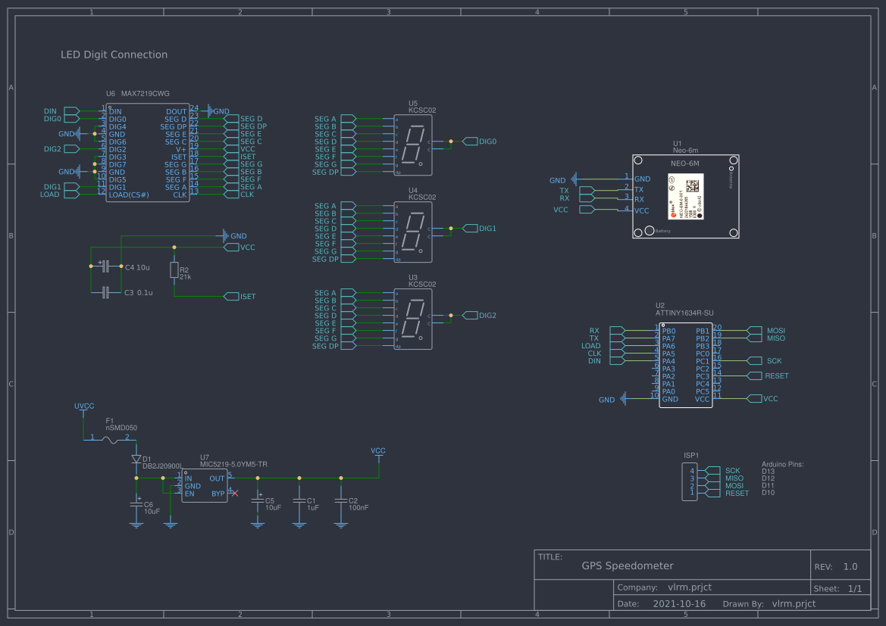

# GPS Speedometer

*Without SoftSerial !*

Copyright (c) 2021 Thomas Meschke

MIT License
https://opensource.org/licenses/mit-license.php

Put the GPS Module ( NEO-6M-x ) on the following pins:

`TX` : Arduino Pro Micro / ATTINY 1634 => `RX` Pin

`RX`: Arduino Pro Micro / ATTINY 1634 => `TX` Pin
## Important note:
By using an ATTINY 1634 use `Serial()` instead of `Serial1()` !

## Libraries

- https://github.com/wayoda/LedControl
- https://github.com/mikalhart/TinyGPSPlus

## Schematic

